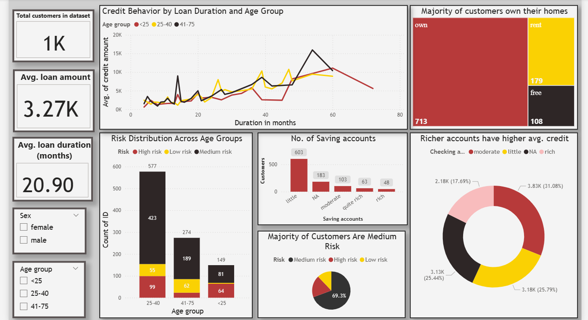

## 📊 Credit Risk Analysis Project
## 📝 Overview

This project analyzes the German Credit Dataset to assess customer credit risk based on demographics, financial status, and loan details. The end-to-end workflow involves data cleaning in Excel, in-depth analysis with SQL, and building an interactive dashboard in Power BI to derive actionable business insights.

---

## 📂 Project Structure
CREDIT-RISK-ANALYSIS-PROJECT

### Data:
   └── Credit_risk_analysis_raw.csv        # Original dataset

### Excel:
   └── Credit_risk_analysis_cleaned.xlsx   # Cleaned dataset + credit scoring logic

### SQL:
   └── customer_database_analysis.sql      # SQL queries & analysis

### PowerBI:
   ├── Visual_analysis.pbix: Interactive Power BI dashboard
   └── Dashboard_screenshot.png: Snapshot of dashboard

### README.md: Project documentation

---

## 🛠 Tools Used
Excel → Data cleaning, credit scoring model, risk categorization.

SQL → Advanced queries (aggregations, CTEs, window functions, joins).

Power BI → Dashboard with interactive visuals to analyze credit trends.

--- 

## 📊 Key Analysis & Insights
Excel

* 

* Created credit scoring system (65–170).

* Categorized customers into Low, Medium, High risk.

SQL

* Ran queries to segment customers by age, housing, and credit amount.

* Used CTEs, window functions, and joins to enrich insights.

* Identified relationships between customer demographics and risk.

Power BI

* KPIs: total customers, average credit amount, average loan duration.

* Line chart: Credit amount trend by loan duration & age group.

* Stacked bar: Customers by age group and risk.

* Donut chart: Average credit amount by checking account type.

* Tree map: Customers by housing type.

---

## 📷 Dashboard Preview

---

## 🙌 Acknowledgment

Dataset adapted from the German Credit Risk dataset.
Project prepared as part of my Data/Business Analyst portfolio.